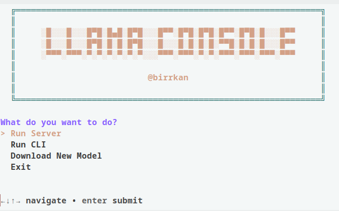
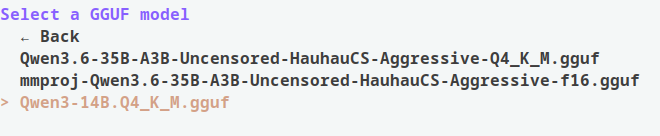
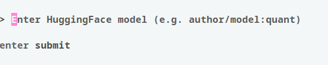

# llama.cpp-management-gui

A small GUI that allows user to:
- serve their local llama.cpp server
- start their local llama.cpp cli
- and download new gguf models from hugging face


### main screen:

### serving a model:

### downloading new model:


## Change the directory of GGUF files:
```sh
# variables ---------------
gguf_model_directory="/home/birkan/Programs/ai-stuff/llama-models/"
```
